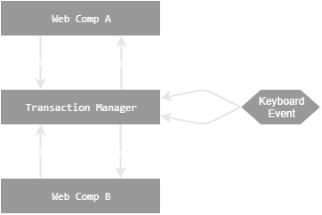

# About
Very lightweight and fast editable web grid with strict MS-Excel adherence to user experience.
Modern as of year 2020 (web components, es6 modules) with **no** dependencies.

If you need to edit mixed hierarchical and grid data, please visit sister project [form-chen](https://decatur.github.io/form-chen).

# Demos, PlayGrounds and Documentation

See [grid-chen at github.io](https://decatur.github.io/grid-chen)

# Usage

```HTML
<!DOCTYPE html>
<body>
<grid-chen></grid-chen>
</body>
<script type="module">
    import "./webwebcomponent.js"
    import {createView} from "./grid-chen/matrixview.js"

    const schema = {
        title: 'Array of Row Arrays',
        type: 'array',
        items: {
            type: 'array',
            items: [
                {title: 'SomeDate', type: 'string', format:'full-date'},
                {title: 'SomeNumber', type: 'number'}
            ]
        }
    };
    const rows = [['2019-01-01', 1], ['2020-01-01', 2], ['2021-01-01', 3]];
    document.querySelector('grid-chen').resetFromView(createView(schema, rows));
</script>
```

# Expected Behaviour

We try to mimic MS-Excel as close as possible.

## Supported Keyboard Shortcuts

See also [Keyboard shortcuts in Excel](https://support.office.com/en-us/article/keyboard-shortcuts-in-excel-1798d9d5-842a-42b8-9c99-9b7213f0040f)

|Key            |               Action               |
|---------------|------------------------------------|
Ctrl+Z              | Undo last transaction
Ctrl+Y              | Redo, reverse last undo
Arrows              | Move active cell up/down/left/right (not in edit mode)
Tab                 | Move active cell right (non-rolling)
Enter               | Move active cell down (non-rolling)
Shift+Enter         | Move active cell up (non-rolling)
Shift+Tab           | Move active cell left (non-rolling)
SHIFT+Arrows        | Select a range of cells
Ctrl+Space          | Select entire column
Shift+Space         | Select entire row
Shift+MouseClick    | Expand selection
Ctrl+MouseClick     | Multi-select cells
Ctrl+'-'            | Delete selected row
Ctrl+'+'            | Insert row before selection
Alt + Enter         | In edit mode, insert newline
Page Down           | Move one page down
Page Up             | Move one page up
Ctrl+A              | Select all grid cells (same as Ctrl+A in an Excel List Object)
Ctrl+A Ctrl+A       | Select the entire grid including header (same as Ctrl+A Ctrl+A in an Excel List Object)
ESC                 | Cancel edit or input mode
Delete              | Remove selected cells contents
Ctrl+C              | Copy selected cells to clipboard
Ctrl+V              | Paste clipboard into selected cells
Ctrl+X              | Cut
F2                  | Enter edit mode; In input or edit mode, toggle between input and edit.
Alt+F1              | Open a modal chart of the selection.
Backspace           | In input or edit mode, deletes one character to the left
Delete              | In input or edit mode, deletes one character to the right
End                 | In input or edit mode, move to the end of the text
Home                | In input or edit mode, move to the beginning of the text

## Light / Dark Mode

grid-chen has a light and dark mode. 
The desired mode is sniffed through the background color intensity of the body element.
There are currently no other explicit CSS hooks, such as CSS custom properties.

⚠ Some dark reader (for example <a href="https://darkreader.org">Dark Reader</a>) extensions may show inferior
results when converting light to dark mode than grid-chen's native dark mode.


## Undo & Redo



# TODOs

* Do not use JSON Patch replace for a remove operation!
* TransactionManager: Do not add properties cell to patch array.
* Handle clipboard not permitted errors
* Improve encapsulation of JavaScript API 
* Show 1 empty row at end (Slider issue)
* Avoid refreshing complete viewport on cell change
* Handling of Infinity and NaN (#NV in de-de)

# Alternatives
* [SpreadJS](https://grapecity.com)
* [SlickGrid](https://github.com/mleibman/SlickGrid)
* [ag-Grid](https://www.ag-grid.com/)
* [canvas-datagrid](https://github.com/TonyGermaneri/canvas-datagrid)
* [fin-hypergrid](https://github.com/fin-hypergrid/core)
* FlexGrid


